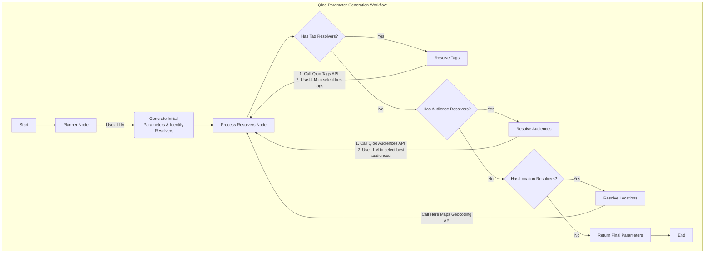

# AdBuddy.ai

AdBuddy.ai is a powerful platform designed to help businesses create, manage, and optimize their advertising campaigns across various social media platforms. By leveraging AI and data-driven insights, AdBuddy.ai simplifies the complex process of ad creation, enabling users to launch effective campaigns with ease.

### Key Features:

- **AI-Powered Campaign Generation:** Utilizes LangChain and OpenAI's GPT-4 to generate complete ad campaigns from user conversations and company data.
- **Multi-Platform Support:** Designed to support campaign creation for platforms like Facebook, Instagram, and TikTok.
- **Data-Driven Insights:** Integrates with the Qloo API to fetch audience data and business insights, enabling highly targeted campaigns.
- **Comprehensive Campaign Planning:** Generates detailed campaign plans, including target audience analysis, creative ideas, to-do lists, KPIs, and budget allocation strategies.
- **User-Friendly Interface:** A modern and intuitive React-based frontend for a seamless user experience.
- **Scalable and Robust Backend:** Built with FastAPI, ensuring high performance and scalability.
- **Advanced AI Agents:** Two distinct LangGraph agents for intelligent campaign creation and data-driven parameter generation.

## LangChain Workflows

AdBuddy.ai utilizes two powerful LangGraph-based workflows to drive its AI capabilities: the **Campaign Generation Workflow** and the **Qloo Parameter Generation Workflow**.

### 1. Campaign Generation Workflow

This workflow is the main engine for creating a comprehensive ad campaign. It orchestrates the entire process from analyzing the initial user conversation to generating a full-fledged campaign strategy.

```mermaid
graph TD
    subgraph Campaign Generation Workflow
        A[Start] --> B[Initial Planning Node];
        B -- Uses LLM with conversation transcript --> B1(Generate Campaign Title & Qloo Query);
        B1 --> C[Fetch Qloo Data Node];
        C -- Invokes Qloo Workflow with Qloo Query --> C1(Get Optimized Qloo API Parameters);
        C1 -- Parameters --> C2[Call Qloo Insights API];
        C2 -- Audience Data & Insights --> D[Generate Enhanced Campaign Node];
        D -- Uses LLM with all collected data --> D1(Create Full Campaign Plan, Creatives, KPIs, etc.);
        D1 --> E[End];
    end
```



#### Workflow Steps:

1.  **Initial Planning Node:**

    - **Input:** Conversation transcript, company name, and company details.
    - **Process:** An LLM call is made to analyze the inputs and generate two key outputs:
      - A concise and memorable title for the ad campaign.
      - A specific query for the Qloo API to find relevant audience data.
    - **Output:** Campaign Title and Qloo Query.

2.  **Fetch Qloo Data Node:**

    - **Input:** The Qloo Query generated in the previous step.
    - **Process:** This node acts as a sub-process orchestrator.
      - It invokes the **Qloo Parameter Generation Workflow** to convert the simple query into a set of detailed, optimized parameters for the Qloo API.
      - It then makes a call to the Qloo `/v2/insights` endpoint with the generated parameters.
    - **Output:** A rich set of audience data and insights from Qloo.

3.  **Generate Enhanced Campaign Node:**
    - **Input:** All previously gathered information, including the conversation transcript, campaign title, and the audience data from Qloo.
    - **Process:** A final, comprehensive LLM call is made to synthesize all the information into a complete campaign plan.
    - **Output:** A structured `EnhancedCampaignOutput` object containing the `AdCampaign` definition, target audience analysis, creative ideas, a to-do list, KPIs, and a budget allocation strategy.

### 2. Qloo Parameter Generation Workflow

This specialized workflow is responsible for the complex task of converting a high-level query into a precise set of parameters for the Qloo API. It's a crucial step for ensuring that the data we fetch is highly relevant.



#### Workflow Steps:

1.  **Planner Node:**

    - **Input:** Company name, company details, and a high-level query (e.g., "Find businesses similar to the given business").
    - **Process:** An LLM generates an initial `QlooParameterSet`. Crucially, it also identifies which parameters need more specific information (like tag IDs, audience IDs, or geographic coordinates) and creates a list of "resolvers" for them.
    - **Output:** A `QlooParameterSet` with some fields filled, and lists of `TagParamsResolver`, `AudienceParamsResolver`, and `LocationResolver`.

2.  **Process Resolvers Node:**
    - **Input:** The initial parameters and the lists of resolvers.
    - **Process:** This node iterates through the resolvers and enriches the parameters.
      - **Tag Resolvers:** It calls the Qloo `/v2/tags` API with a search query. The results are then passed to an LLM to select the most relevant tag IDs.
      - **Audience Resolvers:** Similarly, it calls the Qloo `/v2/audiences/types` API and uses an LLM to pick the best audience IDs from the response.
      - **Location Resolvers:** It calls the Here Maps Geocoding API to convert a location name (e.g., "San Francisco, CA") into precise latitude and longitude coordinates.
    - **Output:** The final, fully-resolved `QlooParameterSet` ready for the insights API call.

## Project Structure

- `/frontend` - React frontend with Vite and TypeScript
- `/backend` - FastAPI backend
- `/scripts` - Utility scripts

## Tech Stack

- **Frontend:** React, Vite, TypeScript, Tailwind CSS
- **Backend:** FastAPI, Python
- **AI/ML:** LangChain, LangGraph, OpenAI GPT-4
- **Database:** MongoDB
- **API:** RESTful API with Pydantic data validation
- **Observability:** Traceloop

## Getting Started

### Backend Setup

1.  Create and activate a virtual environment:

    ```bash
    cd backend
    ./setup_venv.sh
    source venv/bin/activate
    ```

2.  Create a `.env` file based on `.env.example`:

    ```bash
    cp .env.example .env
    # Edit .env with your configuration
    ```

3.  Run the development server:

    ```bash
    uvicorn app.main:app --reload
    ```

4.  API documentation will be available at: `http://localhost:8000/docs`

### Frontend Setup

1.  Install dependencies:

    ```bash
    cd frontend
    npm install
    ```

2.  Start the development server:

    ```bash
    npm run dev
    ```

3.  The development server will start at: `http://localhost:5173`

## API Client Generation

To generate TypeScript clients for the API:

1.  Make sure the backend server is running.
2.  Run the client generator script:
    ```bash
    node scripts/generate_client.js
    ```

## Development Workflow

1.  Start both the backend and frontend development servers.
2.  Make changes to the code.
3.  Generate the API client if the backend API changes.
4.  Test your changes.
5.  Commit your changes.
